<h1 align="center">Nikita Artasov</h1>
<h3 align="center">FullStack Web / Python / Node.js / C++ / Web3 Developer</h3>

 

[-000000?style=flat&logo=x&logoColor=white)](https://x.com/xlartasov)

### Now i'm `Lead` two projects:

* The leading US AI startup for finding relevant acquaintances at events
* A project to automate the maintenance of boiler houses for stable hot water supply in Russia and neighboring
  countries.
  I am responsible for architecture, team management and implementation of Agile processes, and I participate in writing
  code.

 

<h3>Langs</h3>

<h3>Frameworks / Tools</h3>

<h3>DB</h3>

<h3>Software</h3>

<h3>Other</h3>

 
